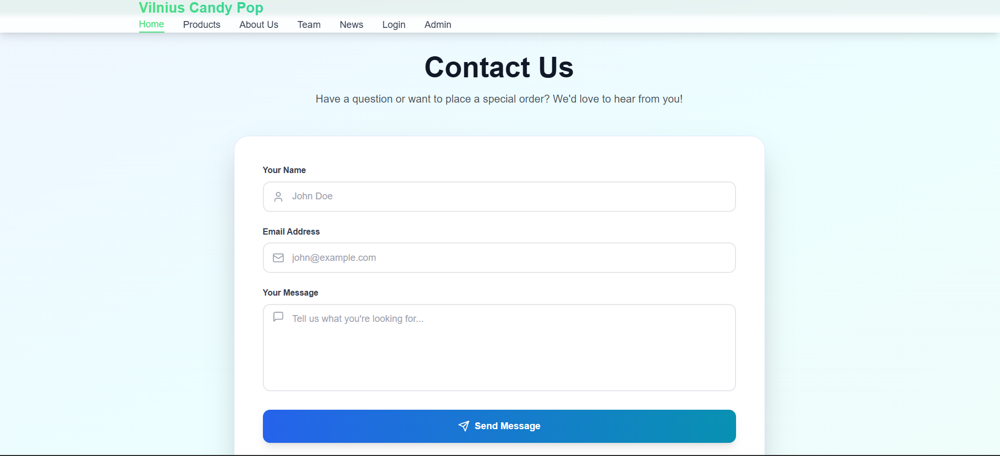
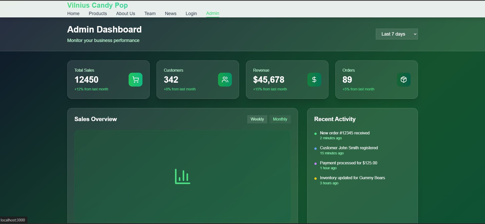
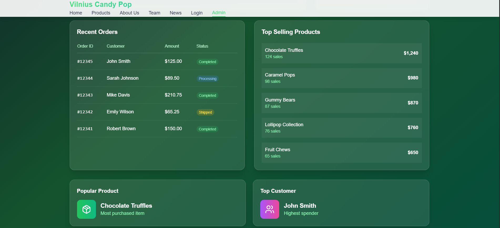
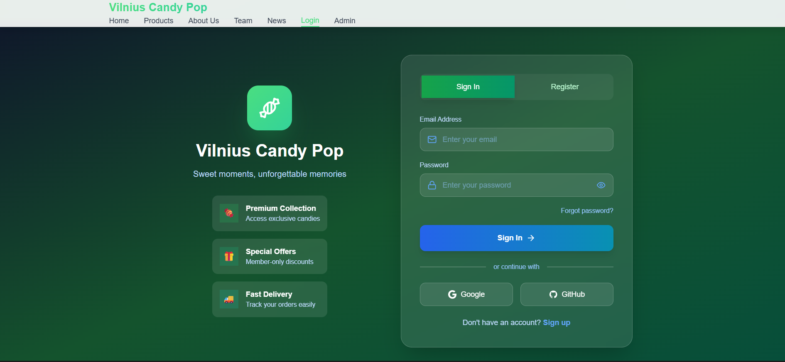
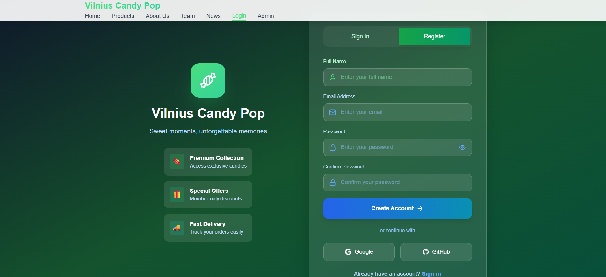

# Hostinger Horizons AI Code Editor

An AI-powered code generation API that modifies React projects using natural language instructions. Built as a proof-of-concept for the Hostinger AI Engineer take-home assignment.

## Problem Statement

Build an API that receives a coding instruction (e.g., "change the header color to blue") and a React project context, then produces the required code changes. The solution must:

- Maintain visual and functional consistency with the existing codebase
- Use only dependencies already present in the project
- Generate changes in unified diff format
- Apply changes via `git apply`

## Solution Overview

This project implements **three distinct approaches** to solve the problem, allowing comparison of their tradeoffs:

| Approach | Endpoint | Description | Best For |
|----------|----------|-------------|----------|
| **Single-Shot** | `/api/v1/generate` | Direct LLM call with full project context | Simple, isolated changes |
| **Multi-Agent** | `/api/v1/agent/generate` | Pipeline with intent parsing, retrieval, planning, execution | Complex changes with validation |
| **ReAct Agent** | `/api/v1/react/generate` | Autonomous agent with tools and reasoning loop | Exploratory, multi-file changes |

## Demo

### Example 1: Contact Form (Single-Shot)
**Instruction:** "Add a contact us form in the bottom of main page, match style of the webpage, customer should be able to enter his name, email address and message"  
**Model:** `gpt-4o` | **Time:** <30s



### Example 2: Admin Dashboard (Multi-Agent)
**Instruction:** "Add a new statistics with dashboards page for admin, where he can see stats about customers, products, etc."  
**Model:** `qwen/qwen3-coder-flash` | **Time:** <2 min




### Example 3: Auth System (ReAct Agent)
**Instruction:** "Add a new customer login, register page"  
**Model:** `qwen/qwen3-coder-flash` | **Time:** 2-3 min




## Key Features

- **Multi-model support** — Use different models for different tasks (cost optimization)
- **Semantic retrieval** — FAISS embeddings + keyword matching for relevant file discovery
- **Build validation** — `npm run build` validation with retry on failure
- **Multiple output formats** — `full_content`, `search_replace`, or `diff`
- **Provider-agnostic** — Works with OpenRouter, OpenAI, or any compatible API

## Quick Start

```bash
# 1. Clone the repository
git clone <repo-url>
cd hostinger-horizons-project

# 2. Clone sample React projects
git clone https://github.com/tomasrasymas/sample-react-projects.git

# 3. Set up backend
cd backend
python -m venv venv
.\venv\Scripts\activate  # Windows
pip install -r requirements.txt

# 4. Configure environment
cp .env.example .env
# Edit .env with your API key (get one from https://openrouter.ai/keys)

# 5. Install sample project dependencies
cd ../sample-react-projects/1-todo-app
npm install

# 6. Start the server
cd ../../backend
uvicorn app.main:app --reload
```

**Test the API:**
```powershell
Invoke-RestMethod -Uri "http://localhost:8000/api/v1/generate" -Method Post `
  -ContentType "application/json" `
  -Body '{"instruction": "change the header background to blue", "project": "1-todo-app"}'
```

See [docs/SETUP.md](docs/SETUP.md) for detailed setup instructions.

## Documentation

| Document | Description |
|----------|-------------|
| [SETUP.md](docs/SETUP.md) | Complete setup guide with troubleshooting |
| [ARCHITECTURE.md](docs/ARCHITECTURE.md) | System design, components, data flow |
| [API.md](docs/API.md) | API reference with request/response examples |
| [APPROACHES.md](docs/APPROACHES.md) | Deep dive into the three approaches |
| [DECISIONS.md](docs/DECISIONS.md) | Technology choices and rationale |
| [DECISIONS.md](docs/DECISIONS.md) | Technology choices and rationale |

## Project Structure

```
hostinger-horizons-project/
├── backend/
│   ├── app/
│   │   ├── api/              # Route handlers (3 endpoints)
│   │   ├── services/         # Core services (LLM, diff, embeddings)
│   │   │   ├── agent/        # Multi-agent pipeline
│   │   │   └── react_agent/  # ReAct loop implementation
│   │   ├── prompts/          # LLM prompt templates
│   │   └── config.py         # Pydantic settings
│   ├── .env.example          # Configuration template
│   └── requirements.txt
├── sample-react-projects/    # ← Clone separately (see Quick Start)
│   ├── 1-todo-app/           # Task management app
│   ├── 2-candy-pop-landing/  # Marketing landing page
│   └── 3-qr-generator/       # QR code generator
└── docs/                     # Documentation
```

## Sample API Request

```json
POST /api/v1/agent/generate

{
  "instruction": "Add a dark mode toggle button to the header",
  "project": "1-todo-app"
}
```

**Response:**
```json
{
  "success": true,
  "diffs": [
    {
      "filename": "src/components/Header.jsx",
      "diff": "--- a/src/components/Header.jsx\n+++ b/src/components/Header.jsx\n..."
    }
  ]
}
```

## Tech Stack

| Technology | Purpose |
|------------|---------|
| FastAPI | Async web framework |
| OpenAI SDK | LLM API calls (OpenRouter/OpenAI compatible) |
| FAISS | Vector similarity search |
| Pydantic | Configuration & validation |
| difflib | Unified diff generation |

## License

This project was created as a take-home assignment for the Hostinger AI Engineer position.
